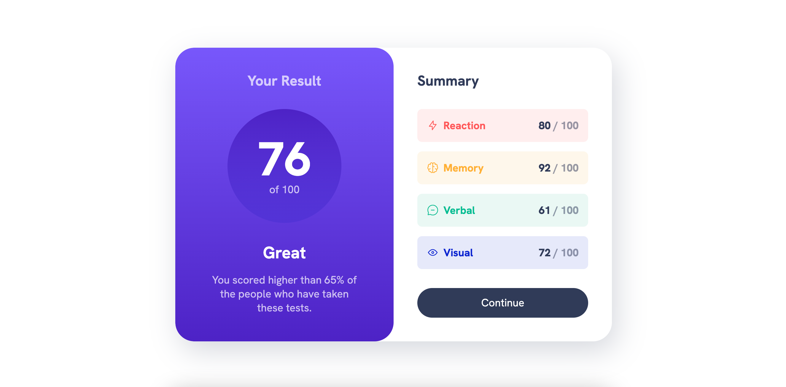

# Frontend Mentor - Results summary component solution

This is a solution to the [Results summary component challenge on Frontend Mentor](https://www.frontendmentor.io/challenges/results-summary-component-CE_K6s0maV). Frontend Mentor challenges help you improve your coding skills by building realistic projects.

## Table of contents

- [Overview](#overview)
  - [The challenge](#the-challenge)
  - [Screenshot](#screenshot)
  - [Links](#links)
- [My process](#my-process)
  - [Built with](#built-with)
  - [What I learned](#what-i-learned)
  - [Continued development](#continued-development)
- [Author](#author)
- [Acknowledgments](#acknowledgments)

## Overview

### The challenge

Users should be able to:

- View the optimal layout for the interface depending on their device's screen size
- See hover and focus states for all interactive elements on the page
- **Bonus**: Use the local JSON data to dynamically populate the content (one day 🤭)

### Screenshot

### Links

- Solution URL: [https://github.com/frontendstu/results-summary-component](https://github.com/frontendstu/results-summary-component)
- Live Site URL: [https://frontendstu.github.io/results-summary-component](https://frontendstu.github.io/results-summary-component)

## My process

### Built with

- Semantic HTML5 markup
- CSS custom properties
- Flexbox
- CSS Grid
- Mobile-first workflow

### What I learned

I followed along with Kevin Powell's video [From Design to Code // HTML & CSS from scratch // Frontend Mentor](https://www.youtube.com/watch?v=KqFAs5d3Yl8) on YouTube.

### Continued development

At a later stage I will revisit this project, convert it to Sass and actually attempt the bonus objective of pulling in local JSON data.

## Author

- GitHub - [GitHub](https://github.com/frontendstu)
- Frontend Mentor - [@frontendstu](https://www.frontendmentor.io/profile/frontendstu)

## Acknowledgments

I'd like to thank Kevin Powell for his amazing tutorial videos. They really are a go-to for me and help with refreshing my knowledge.
