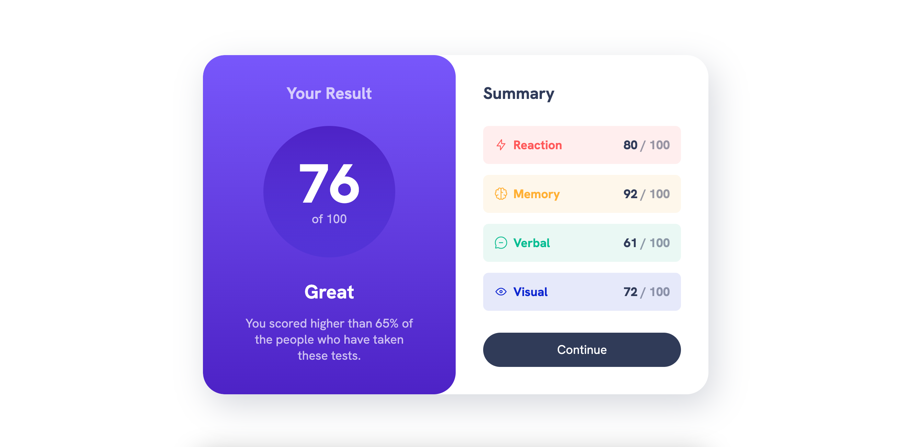

# Frontend Mentor - Results summary component solution

This is a solution to the [Results summary component challenge on Frontend Mentor](https://www.frontendmentor.io/challenges/results-summary-component-CE_K6s0maV). Frontend Mentor challenges help you improve your coding skills by building realistic projects.

## Table of contents

- [Overview](#overview)
  - [The challenge](#the-challenge)
  - [Screenshot](#screenshot)
  - [Links](#links)
- [My process](#my-process)
  - [Built with](#built-with)
  - [What I learned](#what-i-learned)
  - [Continued development](#continued-development)
  - [Useful resources](#useful-resources)
- [Author](#author)
- [Acknowledgments](#acknowledgments)

**Note: Delete this note and update the table of contents based on what sections you keep.**

## Overview

### The challenge

Users should be able to:

- View the optimal layout for the interface depending on their device's screen size
- See hover and focus states for all interactive elements on the page

### Screenshot

### Links

- Solution URL: [https://github.com/frontendstu/results-summary-component](https://github.com/frontendstu/results-summary-component)
- Live Site URL: [ https://frontendstu.github.io/results-summary-component/](https://frontendstu.github.io/results-summary-component/)

## My process

### Built with

- Semantic HTML5 markup
- CSS custom properties
- Flexbox
- CSS Grid
- Mobile-first workflow

### Continued development

I will admit, that this was the work of Kevin Powell from his [YouTube](https://www.youtube.com/watch?v=KqFAs5d3Yl8) video that was specific for this project. I did it as a refresher to see how a professional would go about it developing the solution. I feel that I have been able to give myself a good boost in my knowledge. I am currently learning JavaScript and I aim to add the score summary's dynamic loading from `data.json` shortly.

## Author

- Website - [GitHub](https://github.com/frontendstu)
- Frontend Mentor - [@frontendstu](https://www.frontendmentor.io/profile/frontendstu)
- Twitter - [@deathb4decaf88](https://twitter.com/deathb4decaf88)

## Acknowledgments

A very obvious acknowledgment goes to [Kevin Powell](https://www.kevinpowell.co/) for his [YouTube](https://www.youtube.com/watch?v=KqFAs5d3Yl8) video.
